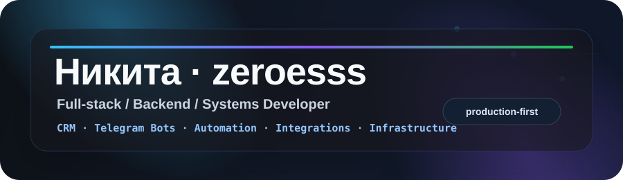
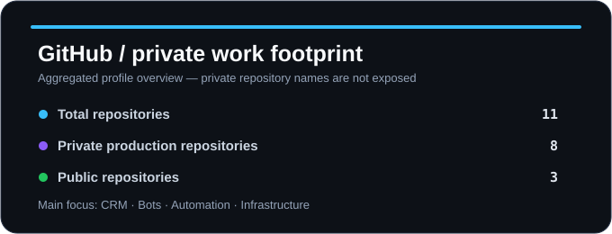
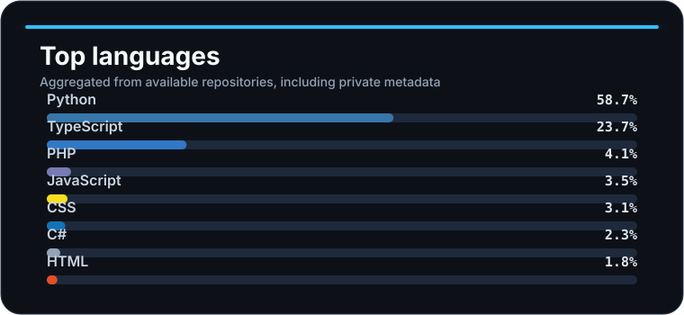

<div align="center">



<br />

Freelance / contract developer building practical production systems: CRMs, Telegram bots, automation pipelines, parsers, integrations, admin panels and backend infrastructure.

<br />
<br />

<a href="https://t.me/zeroe_ss">
  
</a>

</div>

---

## 🛠️ What I do

- Work as a **freelance / contract developer** on business-critical systems
- Build and maintain **production CRM systems** used by real business users
- Develop **Telegram bots**, parsers, automation and notification systems
- Integrate **telephony, payments, APIs, admin panels and internal tools**
- Optimize slow systems, databases, servers and business workflows
- Move products from “works somehow” to **stable, scalable and maintainable**

---

## ⚙️ Tech stack

<div align="center">


</div>

---

## 🚀 Focus areas

```text
Backend engineering      ████████████████████  Production APIs, services, integrations
Business automation      ████████████████████  Bots, parsers, workflows, notifications
CRM / internal tools     ███████████████████░  Admin panels, roles, telephony, tasks
Infrastructure           ████████████████░░░░  VPS, Linux, reverse proxy, optimization
Frontend                 ███████████████░░░░░  React dashboards, forms, UX for operators
```

---

## 🧩 Systems I like building

- Multi-user CRM platforms with roles, permissions and audit trails
- Telephony-integrated workflows: calls, clients, assignments and analytics
- Bots that automate real operational tasks, not just demo chat commands
- Parsers and data pipelines with deduplication, queues and monitoring
- Admin panels where business users can actually work fast

---

## 📊 GitHub activity

<div align="center">



<br />
<br />



</div>

---

## 🧠 How I work

```text
Ship working systems first.
Measure bottlenecks.
Fix what hurts users.
Refactor where it reduces future pain.
Keep production stable.
```

I care about practical architecture: code should survive real users, messy data, integrations, deadlines and business edge cases.

---

<div align="center">

### Building software that makes business operations faster, cleaner and less chaotic.

</div>
